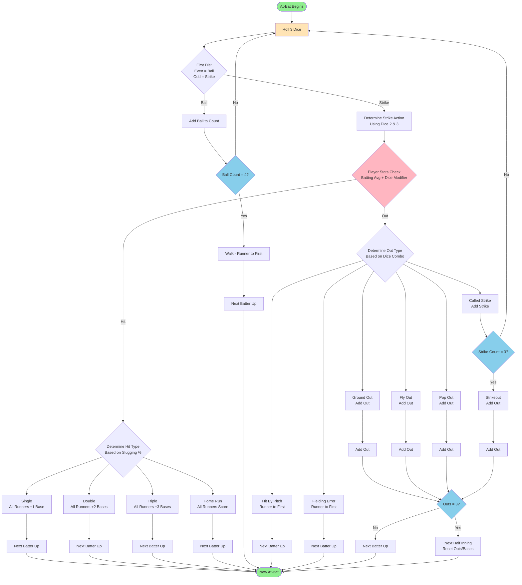

# Baseball Dice Game - At-Bat Logic

This document describes the game logic flow for an at-bat in the baseball dice game.

## Mermaid Diagram

## Key Implementation Details

### Primary Functions

- **Entry Point**: `advanceGameState` in `src/Game/State.hs:162-175`
- **Core Logic**: `runPitch` in `src/Game/Logic.hs:397-413`
- **Dice Processing**: `pitchBallOrStrike` in `src/Game/State.hs:65-69`

### Decision Logic

1. **Pitch Type**: First die determines Ball (even) vs Strike (odd)
2. **Hit Determination**: Player's batting average + dice modifier
3. **Hit Types**: Based on player's slugging percentage
4. **Out Types**: Special dice combinations or random distribution

### State Management

- Ball/Strike counts tracked and checked for walks/strikeouts
- Base runners advanced according to hit type
- Outs accumulated and checked for inning changes
- Batting order cycles through team lineup

